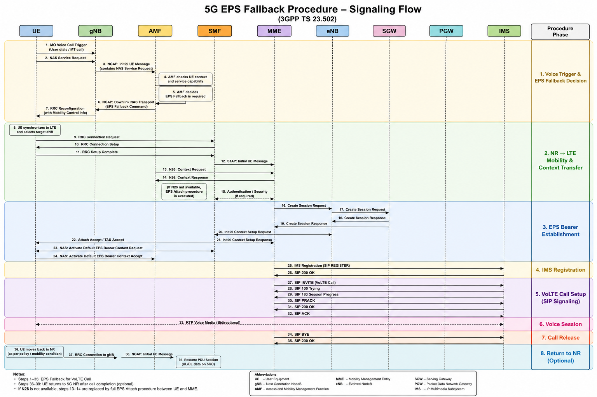

# 5G EPS Fallback Procedure

## Overview

EPS Fallback (Evolved Packet System Fallback) is a standardized mobility procedure that enables a User Equipment (UE) connected to a 5G Standalone (5G SA) network to temporarily move from NR (New Radio) to LTE when a voice service cannot be provided over the 5G radio access network.

Many mobile operators deploy 5G Standalone initially for high-speed data services while continuing to provide voice services through the existing LTE/EPC infrastructure using VoLTE. In such deployments, the network performs an EPS Fallback whenever the UE initiates or receives a voice call and Voice over New Radio (VoNR) is unavailable or not supported.

During this procedure, the UE is redirected or handed over from the 5G NR cell to an LTE cell. Once connected to LTE, the UE establishes the voice session using IMS over VoLTE through the Evolved Packet Core (EPC). After the voice call ends, the UE may return to the 5G NR network depending on operator policy, coverage, and mobility conditions.

EPS Fallback provides seamless voice continuity while allowing operators to gradually migrate from LTE-based voice services to native VoNR without requiring nationwide VoNR deployment.

---

## Objectives

The primary objectives of EPS Fallback are:

- Ensure uninterrupted voice service for subscribers connected to a 5G Standalone network.
- Reuse the existing LTE/EPC and IMS infrastructure for voice services.
- Provide seamless mobility between 5G NR and LTE.
- Minimize voice call setup delay.
- Maintain service continuity during both Mobile Originated (MO) and Mobile Terminated (MT) voice calls.
- Reduce deployment complexity while operators gradually introduce VoNR.

---

## Why EPS Fallback is Required

Although 5G Standalone introduces a cloud-native core network and significantly enhances mobile broadband capabilities, many commercial networks do not initially deploy Voice over New Radio (VoNR).

There are several reasons for this:

- Existing nationwide VoLTE infrastructure is already mature and widely deployed.
- IMS platforms are optimized for LTE voice services.
- VoNR deployment requires software upgrades across the IMS Core, AMF, gNB, UE, and radio network.
- LTE typically provides broader coverage than early 5G SA deployments.
- Operators prefer a phased migration strategy instead of introducing VoNR across the entire network simultaneously.

As a result, the network temporarily moves the UE to LTE whenever voice services are required.

---

## Typical EPS Fallback Scenario

A common voice call scenario is illustrated below.

```text
UE (Connected to 5G NR)

        │
        │ Voice Call Trigger
        ▼

       gNB

        │
        ▼

       AMF

        │
        │ EPS Fallback Decision
        ▼

      LTE eNB

        │
        ▼

       MME

        │
        ▼

    SGW / PGW

        │
        ▼

       IMS

        │
        ▼

     VoLTE Call
```

The UE initially remains connected to the 5G NR network for data services. When a voice call is initiated or received, the network triggers an EPS Fallback procedure, allowing the UE to move to LTE where the voice session is established using VoLTE. Once the voice call is completed, the UE may return to the 5G NR network based on the operator's mobility policy.

---

## EPS Fallback vs VoNR

| Feature | EPS Fallback | VoNR |
|----------|--------------|------|
| Radio Access | LTE | 5G NR |
| Core Network | EPC | 5GC |
| Voice Technology | VoLTE | IMS over NR |
| Mobility | NR → LTE | Remains on NR |
| Call Setup Delay | Slightly Higher | Lower |
| LTE Dependency | Required | Not Required |
| IMS | Required | Required |
| Typical Deployment | Early 5G SA | Mature 5G SA |

---

## Standards

EPS Fallback is defined by the 3GPP specifications listed below.

| Specification | Description |
|--------------|-------------|
| 3GPP TS 23.502 | Procedures for the 5G System |
| 3GPP TS 23.501 | System Architecture for the 5G System |
| 3GPP TS 24.501 | NAS Signalling Procedures |
| 3GPP TS 38.300 | NR Overall Description |
| 3GPP TS 38.413 | NGAP Signalling |
| 3GPP TS 36.413 | S1AP Signalling |
| 3GPP TS 29.274 | GTPv2-C Procedures |
| 3GPP TS 24.229 | IMS SIP Signalling |

---


## EPS Fallback Call Flow

The following figure illustrates the complete 3GPP-compliant EPS Fallback signalling procedure, showing the interaction between the UE, NG-RAN, 5G Core, EPC, and IMS during the transition from 5G NR to LTE for voice service establishment.

<p align="center">
  
</p>

The call flow begins when the UE initiates or receives a voice call while connected to the 5G Standalone network. The AMF determines that voice service must be provided through LTE and triggers the EPS Fallback procedure. The UE is handed over or redirected to LTE, where it attaches to the EPC, registers with IMS if required, and establishes the VoLTE session. After the voice call is completed, the UE may return to the 5G NR network according to the operator's mobility policy.

