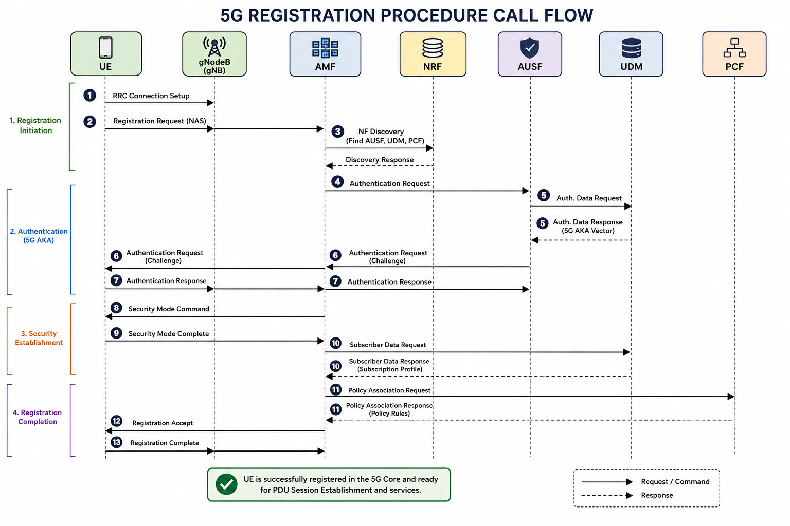
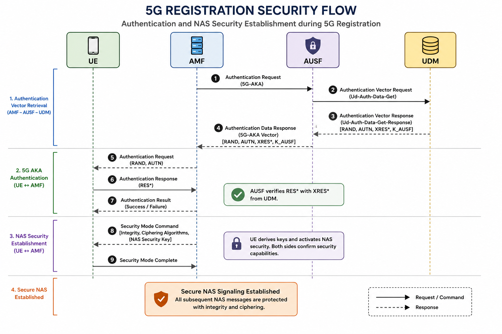

# 5G Registration Procedure

## Overview

The 5G Registration Procedure is the first signaling procedure performed when a User Equipment (UE) accesses a 5G network. During registration, the UE establishes connectivity with the 5G Core (5GC), authenticates with the network, obtains security context, registers with the Access and Mobility Management Function (AMF), and becomes ready to access 5G services.

The procedure is defined in **3GPP TS 23.502** and involves multiple Network Functions communicating through the Service-Based Architecture (SBA).

---

## Objectives

- Register the UE in the 5G Core.
- Authenticate the subscriber.
- Establish NAS security.
- Retrieve subscriber information.
- Register the UE context in the AMF.
- Enable access to network services.

---

## Network Functions Involved

| Network Function | Role |
|------------------|------|
| UE | Initiates the registration procedure. |
| gNodeB (gNB) | Provides NG-RAN access and forwards NAS signaling. |
| AMF | Handles registration, mobility management, and NAS signaling. |
| AUSF | Performs subscriber authentication. |
| UDM | Stores subscriber data and authentication information. |
| PCF | Provides policy rules for the subscriber. |
| NRF | Enables service discovery between Network Functions. |

---
# Registration Procedure

The following steps describe a typical 5G Registration Procedure as defined by 3GPP TS 23.502.

| Step | Description |
|------|-------------|
| **1** | The UE establishes an RRC connection with the gNodeB (gNB). |
| **2** | The UE sends a **Registration Request** NAS message to the AMF via the gNB. |
| **3** | The AMF discovers the AUSF and UDM through the NRF using the Service-Based Architecture (SBA). |
| **4** | The AMF initiates subscriber authentication with the AUSF. |
| **5** | The AUSF obtains authentication vectors from the UDM. |
| **6** | The UE and network perform the 5G AKA authentication procedure. |
| **7** | The AMF establishes NAS security by exchanging Security Mode Command and Security Mode Complete messages with the UE. |
| **8** | The AMF retrieves the subscriber profile and policy information from the UDM and PCF. |
| **9** | The AMF updates the UE registration context in the 5G Core. |
| **10** | The AMF sends a Registration Accept message to the UE. |
| **11** | The UE responds with Registration Complete. |
| **12** | The UE is successfully registered and ready for subsequent procedures such as PDU Session Establishment. |

---
# Message Description

The following table summarizes the major NAS and Service-Based Interface (SBI) messages exchanged during the 5G Registration Procedure.

| Message | Description |
|---------|-------------|
| **Registration Request** | Sent by the UE to initiate registration with the 5G Core. |
| **Authentication Request** | Sent by the network to challenge the UE during the 5G AKA procedure. |
| **Authentication Response** | Sent by the UE containing the authentication response. |
| **Security Mode Command** | Sent by the AMF to establish NAS security algorithms and activate security protection. |
| **Security Mode Complete** | Sent by the UE confirming successful activation of NAS security. |
| **Registration Accept** | Sent by the AMF indicating successful UE registration and providing network parameters. |
| **Registration Complete** | Sent by the UE acknowledging successful completion of the registration procedure. |

---

## Registration Success Criteria

A successful 5G Registration Procedure is achieved when:

- The UE is authenticated successfully.
- NAS security is established.
- Subscriber information is retrieved from the UDM.
- Policy information is obtained from the PCF.
- The UE context is created in the AMF.
- The UE receives the Registration Accept message.
- The UE sends Registration Complete.
- The UE is ready to establish PDU Sessions and access 5G services.

  ---

# Registration Call Flow

The following diagram illustrates the end-to-end 5G Registration Procedure, showing the interaction between the User Equipment (UE), gNodeB (gNB), Access and Mobility Management Function (AMF), Network Repository Function (NRF), Authentication Server Function (AUSF), Unified Data Management (UDM), and Policy Control Function (PCF).

---

# Security During Registration

## Overview

Security is an essential part of the 5G Registration Procedure. Before a UE can access network services, the network authenticates the subscriber, establishes a secure NAS connection, and protects all subsequent signaling exchanges.

---

## Security Features

- Mutual authentication using the 5G AKA procedure.
- Authentication performed by the AUSF with subscriber credentials stored in the UDM.
- NAS integrity and ciphering activated through the Security Mode procedure.
- Security context established and maintained by the AMF.
- Service-Based Interface (SBI) communication secured using TLS and OAuth 2.0.

---

## Benefits

- Verifies subscriber identity.
- Prevents unauthorized network access.
- Protects NAS signaling from tampering and interception.
- Establishes a trusted security context for subsequent 5G procedures.
- Provides a secure foundation for PDU Session Establishment and other services.

- ---

## Registration Security Flow

The following diagram illustrates the authentication, security context establishment, and NAS security activation during the 5G Registration Procedure.

---

# Troubleshooting

The following table lists common issues encountered during the 5G Registration Procedure and their possible causes.

| Issue | Possible Cause | Recommended Action |
|-------|----------------|--------------------|
| Registration Request rejected | Invalid UE identity or subscription | Verify the SUPI/SUCI and subscriber provisioning in the UDM. |
| Authentication failure | Incorrect authentication vectors or subscriber credentials | Check AUSF and UDM synchronization and verify authentication data. |
| Registration timeout | AMF or gNB communication issue | Verify NGAP connectivity, SCTP status, and AMF availability. |
| Security Mode failure | NAS security mismatch | Confirm selected integrity and ciphering algorithms are supported by both UE and AMF. |
| Subscriber data retrieval failure | UDM unavailable or SBI communication issue | Verify UDM registration with the NRF and check HTTP/2/TLS connectivity. |
| Policy association failure | PCF unavailable | Check PCF health and SBI communication between the AMF and PCF. |
| HTTP 401 / 403 responses | Authentication or authorization failure | Verify OAuth 2.0 tokens and TLS certificates. |
| Registration repeatedly fails | Network configuration or roaming issue | Review AMF logs, UE logs, subscriber configuration, and SBI message traces. |

---

# Related Procedures

The following procedures are closely related to the 5G Registration Procedure:

- Service-Based Architecture (SBA)
- Authentication and Security
- PDU Session Establishment
- UE Deregistration
- UE Configuration Update
- Mobility Registration Update
- Network Slice Selection
- Policy Control
- Session Management

  ---

# References

1. 3GPP TS 23.501 – System Architecture for the 5G System (5GS)
2. 3GPP TS 23.502 – Procedures for the 5G System (5GS)
3. 3GPP TS 24.501 – Non-Access-Stratum (NAS) Protocol for the 5G System
4. 3GPP TS 29.500 – Technical Realization of the Service-Based Architecture
5. 3GPP TS 29.501 – Principles and Guidelines for the Service-Based Architecture
6. 3GPP TS 33.501 – Security Architecture and Procedures for the 5G System
7. ETSI NFV Documentation
8. Huawei 5G Core Product Documentation

  

