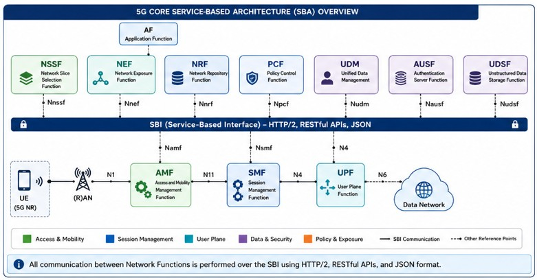
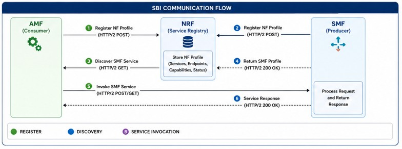
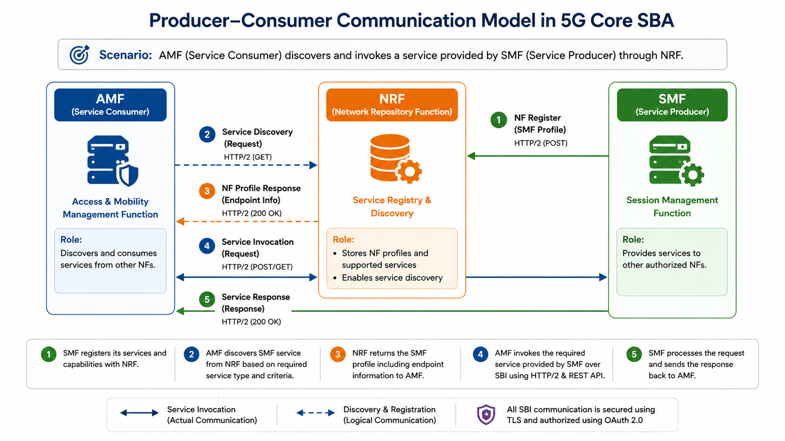
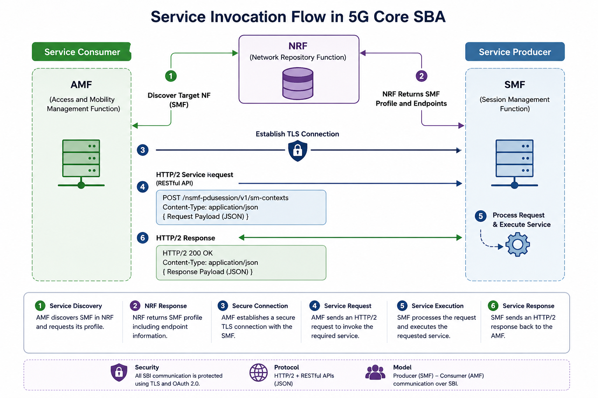

# Service-Based Architecture (SBA)

## Overview

The **Service-Based Architecture (SBA)** is the architectural foundation of the 5G Core (5GC), introduced by the 3rd Generation Partnership Project (3GPP) to replace the traditional point-to-point interface model used in previous generations of mobile core networks.

Unlike the LTE Evolved Packet Core (EPC), where network functions communicate through dedicated interfaces such as S1-MME, S11, S5/S8, and Gx, the 5G Core adopts a service-oriented communication model in which Network Functions (NFs) expose standardized services that can be discovered and consumed by other authorized Network Functions.

Communication between Network Functions is performed over the **Service-Based Interface (SBI)** using HTTP/2 and RESTful APIs with JSON data encoding. This enables dynamic service discovery, independent scaling, cloud-native deployment, and greater operational flexibility.

The Service-Based Architecture simplifies network evolution by decoupling Network Functions, allowing services to be added, upgraded, or scaled independently without impacting the overall architecture. It also provides the foundation for network slicing, automation, service orchestration, and modern cloud-native mobile core deployments.

As the fundamental architectural model of the 5G Core, the SBA enables interoperable, programmable, and highly scalable mobile networks capable of supporting a wide range of consumer, enterprise, and mission-critical services.

---

# Objectives

This document provides a comprehensive overview of the Service-Based Architecture (SBA) within the 5G Core (5GC), explaining its architectural principles, communication model, and operational benefits as defined by the 3GPP.

The objectives of this document are to:

- Explain the evolution from interface-based architecture in LTE EPC to the service-oriented architecture of the 5G Core.
- Describe the role of the Service-Based Interface (SBI) in enabling communication between Network Functions (NFs).
- Explain how Network Functions register, discover, and consume services through the Network Repository Function (NRF).
- Illustrate the producer–consumer communication model used by the 5G Core.
- Describe the protocols, security mechanisms, and technologies used within the SBA.
- Highlight the operational advantages of cloud-native and service-based network design.
- Provide the architectural foundation required to understand subsequent 5G Core signaling procedures and Network Functions.

  ---

# Key Characteristics

The Service-Based Architecture introduces a modern communication framework that enables modular, scalable, and interoperable Network Functions within the 5G Core.

Its key characteristics include:

- Service-oriented communication between Network Functions.
- Standardized Service-Based Interfaces (SBIs).
- HTTP/2 and RESTful API-based messaging.
- JSON-based data representation.
- Dynamic service registration and discovery through the NRF.
- Producer–Consumer communication model.
- Stateless Control Plane Network Functions.
- Independent scaling of individual services.
- Cloud-native deployment using virtualization and container technologies.
- Secure communication using TLS and OAuth 2.0 authorization.
- High availability through redundant and distributed Network Functions.
- Vendor-neutral interoperability based on 3GPP standards.

- ---

# SBA Components

The Service-Based Architecture (SBA) is composed of multiple functional components that work together to provide standardized, service-oriented communication within the 5G Core. Each component has a specific responsibility, enabling Network Functions (NFs) to discover, authenticate, and consume services in a secure and scalable manner.

Unlike traditional interface-based architectures, where communication paths are statically defined, the SBA enables dynamic interaction between Network Functions through standardized Service-Based Interfaces (SBIs). This modular approach improves flexibility, scalability, resiliency, and interoperability across the mobile core network.

The principal components of the Service-Based Architecture are described below.

| Component | Description |
|-----------|-------------|
| **Network Functions (NFs)** | Functional entities that provide specific control plane services such as mobility management, session management, policy control, subscriber management, and authentication. |
| **Service-Based Interface (SBI)** | The standardized communication framework that enables Network Functions to exchange information using HTTP/2 and RESTful APIs. |
| **Network Repository Function (NRF)** | Maintains the registry of available Network Functions, their supported services, capabilities, and operational status. It enables service registration and discovery. |
| **NF Service Producer** | A Network Function that publishes one or more services for consumption by other authorized Network Functions. |
| **NF Service Consumer** | A Network Function that discovers and invokes services provided by another Network Function through the Service-Based Interface. |
| **NF Service Instance** | A deployable instance of a Network Function capable of providing one or more standardized services. Multiple instances may exist to support redundancy and load balancing. |
| **NF Profile** | A standardized profile registered with the NRF containing service information, supported capabilities, endpoint addresses, version information, and operational status of a Network Function. |
| **Service Registry** | The logical repository maintained by the NRF that stores information about all registered Network Functions and their available services. |
| **Security Framework** | Provides authentication, authorization, confidentiality, and integrity protection for Service-Based Interface communication using TLS and OAuth 2.0. |
| **Service Discovery Mechanism** | Enables Network Functions to dynamically locate suitable service providers based on service type, supported capabilities, network slice, locality, or other selection criteria. |

Together, these components form the foundation of the Service-Based Architecture, enabling the 5G Core to operate as a cloud-native, service-oriented platform capable of supporting highly scalable, resilient, and programmable mobile networks.

---
# Architecture Diagram

The following diagram illustrates the overall Service-Based Architecture (SBA) of the 5G Core. It shows the major Network Functions (NFs), the Service-Based Interface (SBI), and the communication model used between Network Functions.

# Service-Based Interface (SBI)

## Overview

The **Service-Based Interface (SBI)** is the standardized communication framework that enables interaction between Network Functions (NFs) within the 5G Core (5GC). Introduced as part of the Service-Based Architecture (SBA), the SBI replaces the traditional point-to-point interface model used in previous mobile core networks with a flexible, service-oriented communication mechanism.

Unlike the LTE Evolved Packet Core (EPC), where Network Functions communicate through dedicated interfaces such as S11, Gx, and S6a using protocols like GTP and Diameter, the 5G Core enables Network Functions to expose standardized services that can be dynamically discovered and consumed by other authorized Network Functions.

Communication over the SBI is based on **HTTP/2**, **RESTful APIs**, and **JSON** data encoding, allowing Network Functions to exchange information using modern web technologies while maintaining interoperability across multi-vendor deployments.

The Service-Based Interface enables dynamic service discovery, independent Network Function scaling, simplified service integration, and cloud-native deployment, making it one of the key innovations of the 5G Core architecture.

---

# SBI Communication Flow

The following diagram illustrates the typical Service-Based Interface (SBI) communication workflow. It demonstrates how Network Functions register with the Network Repository Function (NRF), discover available services, and invoke standardized services over HTTP/2 using RESTful APIs.

---

## Communication Technologies

The Service-Based Interface utilizes widely adopted Internet technologies to provide secure, reliable, and standardized communication between Network Functions.

| Technology | Purpose |
|------------|---------|
| **HTTP/2** | Transport protocol used for service-based communication between Network Functions. |
| **RESTful APIs** | Standardized application programming interfaces used to request and provide network services. |
| **JSON** | Lightweight data format used for exchanging service information between Network Functions. |
| **TLS** | Provides confidentiality, integrity, and authentication for SBI communication. |
| **OAuth 2.0** | Provides authorization and access control for service requests between Network Functions. |

---

## Service Communication Model

Within the Service-Based Architecture, every Network Function may operate as both a **Service Producer** and a **Service Consumer**.

A Service Producer exposes one or more standardized services through the Service-Based Interface, while a Service Consumer discovers those services through the Network Repository Function (NRF) and invokes them using HTTP/2 requests.

This communication model eliminates static interface dependencies and enables Network Functions to interact dynamically based on service availability and operational requirements.

---

## Common Service-Based Interfaces

The 3GPP defines a standardized set of service interfaces that enable communication between Network Functions.

| Service Interface | Description |
|-------------------|-------------|
| **Namf** | Services provided by the Access and Mobility Management Function (AMF). |
| **Nsmf** | Session Management services provided by the Session Management Function (SMF). |
| **Nudm** | Subscriber management services provided by the Unified Data Management (UDM). |
| **Nausf** | Authentication services provided by the Authentication Server Function (AUSF). |
| **Npcf** | Policy Control services provided by the Policy Control Function (PCF). |
| **Nnrf** | Registration and discovery services provided by the Network Repository Function (NRF). |
| **Nnef** | Network capability exposure services provided by the Network Exposure Function (NEF). |
| **Nnssf** | Network Slice Selection services provided by the Network Slice Selection Function (NSSF). |
| **Nudsf** | Unstructured data storage services provided by the Unstructured Data Storage Function (UDSF). |

---

## Benefits of the Service-Based Interface

The adoption of the Service-Based Interface provides several architectural and operational advantages:

- Standardized communication based on open Internet technologies.
- Dynamic service registration and discovery.
- Vendor-neutral interoperability.
- Independent scaling of Network Functions.
- Simplified integration of new services.
- Cloud-native deployment and orchestration.
- Improved resiliency through service redundancy.
- Flexible deployment across centralized and distributed cloud environments.
- Enhanced security through TLS and OAuth 2.0.
- Support for automation and lifecycle management.

The Service-Based Interface is a fundamental enabler of the cloud-native 5G Core, providing the communication framework that allows Network Functions to operate as modular, reusable, and independently scalable services.

---

# Producer–Consumer Communication Model

## Overview

The Service-Based Architecture (SBA) follows a **Producer–Consumer communication model**, where Network Functions (NFs) expose standardized services that can be dynamically consumed by other authorized Network Functions.

Unlike traditional interface-based communication, where signaling paths are statically defined, the SBA allows Network Functions to operate independently while interacting through standardized service APIs. This loose coupling improves scalability, resiliency, flexibility, and simplifies the introduction of new network capabilities.

In the SBA, a Network Function may simultaneously operate as both a **Service Producer** and a **Service Consumer**, depending on the procedure being executed.

---

## Service Producer

A **Service Producer** is a Network Function that exposes one or more standardized services through the Service-Based Interface (SBI).

Examples include:

- AMF providing mobility management services.
- SMF providing PDU Session management services.
- UDM providing subscriber data services.
- PCF providing policy control services.
- AUSF providing authentication services.

Before providing services, the Network Function registers its supported services and capabilities with the Network Repository Function (NRF).

---

## Service Consumer

A **Service Consumer** is a Network Function that discovers and invokes services offered by another authorized Network Function.

Rather than maintaining static peer relationships, the Service Consumer queries the NRF to locate a suitable Service Producer based on service type, supported capabilities, network slice, locality, or deployment policies.

This dynamic discovery mechanism enables flexible service selection and improves network resiliency.

---

## Communication Workflow

The Producer–Consumer interaction generally follows these steps:

1. A Network Function registers its service profile with the NRF.
2. The NRF stores the Network Function profile and advertised services.
3. A Service Consumer queries the NRF to discover an appropriate Service Producer.
4. The NRF returns the endpoint information of the selected Network Function.
5. The Service Consumer invokes the required service over the Service-Based Interface using HTTP/2 and RESTful APIs.
6. The Service Producer processes the request and returns the appropriate response.

This dynamic workflow allows Network Functions to communicate without predefined static connections, enabling independent deployment, scaling, and lifecycle management.

---

## Producer–Consumer Communication Diagram

The following diagram illustrates the Producer–Consumer communication model within the Service-Based Architecture. It shows how a Network Function acting as a Service Consumer discovers a Service Producer through the Network Repository Function (NRF) and invokes the required service using the Service-Based Interface (SBI).

---

## Practical Example

During a Registration procedure:

- The AMF operates as a **Service Consumer** when requesting subscriber information from the UDM.
- The UDM operates as a **Service Producer** by providing subscription data.
- During authentication, the AUSF becomes the Service Producer.
- During PDU Session Establishment, the SMF acts as the Service Producer for session management services.

Depending on the procedure, a single Network Function may switch between producer and consumer roles.

---

## Key Benefits

The Producer–Consumer model provides several operational advantages:

- Loose coupling between Network Functions.
- Dynamic service discovery.
- Independent Network Function scaling.
- Simplified software upgrades.
- Improved resiliency through redundant service instances.
- Efficient cloud-native deployments.
- Standardized interoperability across vendors.
- Reduced operational complexity compared to static interface-based communication.

  ---

# Network Function Registration

## Overview

Before a Network Function (NF) can provide services within the Service-Based Architecture (SBA), it must first register with the **Network Repository Function (NRF)**. This registration process enables the NRF to maintain an up-to-date repository of available Network Functions, their capabilities, supported services, API versions, endpoint addresses, and operational status.

By maintaining this centralized service registry, the NRF allows other authorized Network Functions to dynamically discover and communicate with suitable service providers without relying on static peer configurations.

---

## Registration Information

During registration, a Network Function typically provides the following information to the NRF:

| Information | Description |
|------------|-------------|
| **NF Instance ID** | Unique identifier of the Network Function instance. |
| **NF Type** | Type of Network Function (AMF, SMF, PCF, UDM, etc.). |
| **Supported Services** | List of services exposed by the Network Function. |
| **API Version** | Supported Service-Based Interface API versions. |
| **Endpoint Address** | URI used by other Network Functions to access the service. |
| **NF Status** | Operational status (Registered, Suspended, or Deregistered). |
| **Supported S-NSSAIs** | Supported Network Slice information, where applicable. |
| **Locality Information** | Geographic or deployment locality used for service selection. |

---

## Registration Procedure

A typical Network Function registration follows these steps:

1. The Network Function starts and initializes its supported services.
2. The Network Function sends an **NF Register** request to the NRF.
3. The NRF validates the registration request.
4. The NRF stores the NF Profile within its service repository.
5. The NRF returns a successful registration response.
6. The Network Function becomes discoverable by other authorized Network Functions.

---

## Benefits

Network Function registration provides several operational advantages:

- Dynamic service availability.
- Automatic service discovery.
- Simplified scaling of Network Functions.
- Support for redundancy and high availability.
- Improved resiliency through multiple NF instances.
- Elimination of static peer configurations.
- Simplified cloud-native lifecycle management.

Successful registration with the NRF is a mandatory prerequisite for Network Functions participating in Service-Based Architecture communication.

---

# Service Discovery

## Overview

Service Discovery is the process by which a Network Function (NF) dynamically locates another Network Function that provides a required service. Instead of relying on predefined peer configurations, the Service Consumer queries the **Network Repository Function (NRF)** to identify a suitable Service Producer based on service type, capabilities, network slice, locality, and operational status.

This dynamic discovery mechanism improves flexibility, scalability, and resiliency by allowing Network Functions to communicate without maintaining static relationships.

---

## Discovery Procedure

A typical Service Discovery procedure consists of the following steps:

1. A Service Consumer determines that it requires a specific network service.
2. The Service Consumer sends an **NF Discovery** request to the NRF.
3. The NRF searches its repository for matching Network Functions.
4. The NRF returns one or more suitable NF Profiles.
5. The Service Consumer selects an appropriate Service Producer.
6. The Service Consumer invokes the required service through the Service-Based Interface (SBI).

---

## Discovery Criteria

The NRF may use several criteria when selecting a suitable Network Function.

| Selection Criteria | Description |
|--------------------|-------------|
| **NF Type** | Required Network Function (AMF, SMF, PCF, UDM, etc.). |
| **Supported Service** | Requested service exposed by the Network Function. |
| **NF Status** | Current operational status of the Network Function. |
| **Network Slice** | Matching S-NSSAI, where applicable. |
| **Locality** | Preferred geographic or deployment location. |
| **Capacity** | Available resources and load conditions. |
| **Priority** | Operator-defined service selection policies. |

---

## Benefits

Dynamic Service Discovery provides several advantages:

- Eliminates static peer configuration.
- Supports automatic failover.
- Enables load balancing across multiple NF instances.
- Simplifies cloud-native scaling.
- Improves service resiliency.
- Supports flexible deployment and orchestration.

Service Discovery is a key capability of the Service-Based Architecture, allowing Network Functions to locate and consume services dynamically while maintaining high availability and operational flexibility.

---

# Security in the Service-Based Architecture

## Overview

Security is a fundamental design principle of the Service-Based Architecture (SBA). Since Network Functions (NFs) communicate using HTTP/2 and RESTful APIs over IP networks, robust security mechanisms are required to ensure that only authenticated and authorized Network Functions can exchange information.

The 3GPP defines multiple security mechanisms to protect Service-Based Interface (SBI) communication against unauthorized access, data tampering, and interception.

---

## Security Mechanisms

| Security Mechanism | Purpose |
|--------------------|---------|
| **Transport Layer Security (TLS)** | Provides encryption, integrity protection, and mutual authentication between Network Functions. |
| **OAuth 2.0** | Authorizes Network Functions to access specific services exposed by other Network Functions. |
| **Mutual Authentication** | Verifies the identity of both the Service Consumer and Service Producer before communication is established. |
| **Access Control** | Restricts service access based on predefined authorization policies. |
| **Certificate Management** | Uses X.509 certificates to establish trusted communication between Network Functions. |

---

## Security Workflow

A typical SBI security process consists of the following steps:

1. The Service Consumer discovers the target Network Function through the NRF.
2. A secure TLS session is established between the communicating Network Functions.
3. The Service Consumer obtains an OAuth 2.0 access token, when required.
4. The Service Producer validates the access token and authorizes the request.
5. Secure service communication proceeds over the established SBI connection.

---

## Benefits

The SBA security framework provides:

- Mutual authentication between Network Functions.
- Confidentiality of exchanged information.
- Integrity protection against message modification.
- Authorization based on standardized access control policies.
- Secure communication across multi-vendor and cloud-native deployments.

These security mechanisms ensure that Service-Based Interface communication remains secure, trusted, and compliant with 3GPP security requirements.

---

# Service Invocation

## Overview

After successful registration, service discovery, and security establishment, Network Functions (NFs) can invoke services exposed by other authorized Network Functions through the Service-Based Interface (SBI).

Service invocation follows the Producer–Consumer model, where the Service Consumer sends an HTTP/2 request to the Service Producer using RESTful APIs. The Service Producer processes the request and returns the appropriate response. This mechanism enables dynamic, standardized, and interoperable communication between Network Functions within the 5G Core.

---

## Service Invocation Procedure

A typical service invocation consists of the following steps:

1. The Service Consumer discovers the target Network Function through the NRF.
2. A secure TLS connection is established.
3. The Service Consumer sends an HTTP/2 request to the Service Producer.
4. The Service Producer validates and processes the request.
5. The requested service is executed.
6. The Service Producer returns an HTTP/2 response to the Service Consumer.

---

## HTTP Methods Used

| HTTP Method | Purpose |
|-------------|---------|
| **GET** | Retrieve information from a Network Function. |
| **POST** | Create a new resource or initiate a procedure. |
| **PUT** | Update an existing resource. |
| **DELETE** | Remove an existing resource. |

---

## Benefits

- Standardized communication between Network Functions.
- Dynamic service invocation.
- Reduced dependency on static interfaces.
- Faster service integration.
- Improved scalability and interoperability.

- ---

## Service Invocation Flow

The following diagram illustrates how a Service Consumer invokes a service provided by another Network Function using the Service-Based Interface (SBI).

