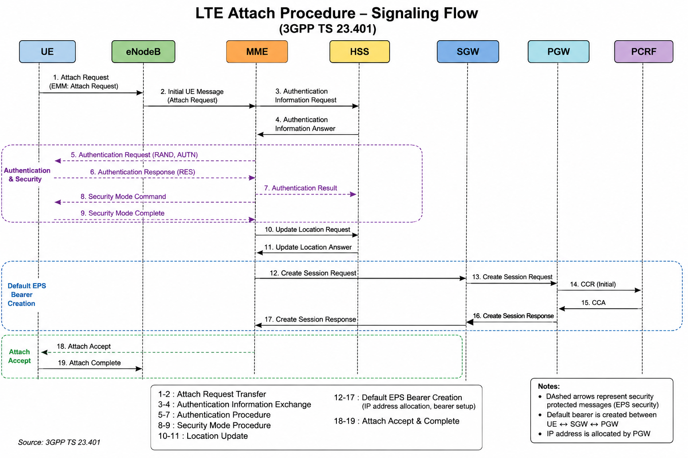

# LTE Attach Procedure

## Overview

The LTE Attach procedure is the first signaling procedure executed when a User Equipment (UE) connects to an LTE network.

During this procedure, the network authenticates the subscriber, establishes mobility management context, creates the default EPS bearer, and allocates an IP address for data connectivity.

The Attach procedure enables the UE to access LTE packet services.

---

## Objectives

The LTE Attach procedure performs the following functions:

- Authenticate the subscriber
- Register the UE with the EPC
- Create the default EPS bearer
- Allocate an IP address
- Establish user plane connectivity
- Enable packet data services

---

## Network Elements

The following network elements participate in the LTE Attach procedure:

- UE (User Equipment)
- eNodeB
- MME
- HSS
- SGW
- PGW
- PCRF (optional depending on deployment)

---

## LTE Attach Signaling Flow

## Summary

The LTE Attach procedure establishes the UE's connection to the Evolved Packet Core (EPC), enabling access to LTE packet data services. During this procedure, the subscriber is authenticated, security is activated, the UE is registered with the Mobility Management Entity (MME), a default EPS bearer is created, and an IP address is assigned by the Packet Data Network Gateway (PGW).

Upon successful completion of the Attach procedure, the UE is ready to exchange user-plane traffic and access network services.

## Message Summary

| Step | Message | From | To | Purpose |
|------|---------|------|----|---------|
| 1 | Attach Request | UE | eNodeB | Initiates LTE network registration |
| 2 | Initial UE Message | eNodeB | MME | Forwards the NAS Attach Request |
| 3 | Authentication Information Request/Answer | MME | HSS | Retrieves authentication vectors |
| 4 | Authentication Request/Response | MME | UE | Authenticates the subscriber |
| 5 | Security Mode Command/Complete | MME | UE | Activates NAS security |
| 6 | Update Location Request/Answer | MME | HSS | Updates subscriber location |
| 7 | Create Session Request/Response | MME | SGW/PGW | Creates the default EPS bearer and allocates an IP address |
| 8 | Attach Accept | MME | UE | Confirms successful attachment |
| 9 | Attach Complete | UE | MME | Completes the Attach procedure |

## Detailed Signaling

### 1. Attach Request (UE → eNodeB)

The LTE Attach procedure begins when the UE sends an **Attach Request** NAS message to the eNodeB. This message indicates that the UE wants to register with the EPC and access packet data services.

The Attach Request typically includes:
- IMSI or GUTI
- UE Network Capability
- EPS Attach Type
- Last Visited TAI (if available)
- PDN Connectivity Request

The eNodeB does not process the NAS message. Instead, it encapsulates the message within an **Initial UE Message** over the S1-AP interface and forwards it to the MME.

### 2. Initial UE Message (eNodeB → MME)

After receiving the NAS Attach Request from the UE, the eNodeB encapsulates the NAS message inside an **Initial UE Message** and forwards it to the MME over the **S1-AP** interface.

The Initial UE Message allows the MME to create a temporary UE context and begin the mobility management procedure.

The message typically contains:
- NAS Attach Request
- eNodeB UE S1AP ID
- Tracking Area Identity (TAI)
- E-UTRAN Cell Global Identifier (ECGI)
- RRC Establishment Cause
- S-TMSI (if available)

Upon receiving this message, the MME starts processing the Attach procedure and determines whether subscriber authentication is required.

### 3. Authentication Information Request / Authentication Information Answer (MME ↔ HSS)

After receiving the Initial UE Message, the MME checks whether it already has valid authentication vectors for the subscriber. If no valid vectors are available, the MME sends an **Authentication Information Request (AIR)** to the HSS over the **S6a** interface.

The HSS retrieves the subscriber's authentication data and generates one or more **EPS Authentication Vectors (AVs)** using the subscriber's secret key stored in the USIM.

The HSS then returns an **Authentication Information Answer (AIA)** containing the authentication vectors to the MME.

The authentication vectors typically include:
- RAND (Random Challenge)
- XRES (Expected Response)
- AUTN (Authentication Token)
- KASME (Key for NAS Security)

The MME stores these vectors and uses them in the next step to authenticate the UE.

### 4. Authentication Request / Authentication Response (MME ↔ UE)

Using the authentication vectors received from the HSS, the MME initiates subscriber authentication by sending an **Authentication Request** to the UE.

The Authentication Request contains the **RAND** (Random Challenge) and **AUTN** (Authentication Token). The UE verifies the authenticity of the network using the AUTN and computes an authentication response using the secret key stored in the USIM.

If the verification is successful, the UE returns an **Authentication Response** containing the calculated **RES (Response)**.

The MME compares the received RES with the expected response (XRES) obtained from the HSS. If they match, the subscriber is successfully authenticated and the Attach procedure continues. Otherwise, the Attach procedure is rejected.

**Interface:** S1-MME (NAS Signaling)  
**Protocol:** NAS  
**Direction:** MME → UE → MME

### 5. Security Mode Command / Security Mode Complete (MME ↔ UE)

After successful subscriber authentication, the MME initiates the NAS security procedure by sending a **Security Mode Command** to the UE. This message instructs the UE to activate the selected integrity protection and ciphering algorithms for NAS signaling.

The UE configures the requested security algorithms and responds with a **Security Mode Complete** message to confirm successful activation.

Once this procedure is completed, all subsequent NAS signaling messages are protected against tampering and unauthorized access.

**Interface:** S1-MME (NAS Signaling)  
**Protocol:** NAS  
**Direction:** MME → UE → MME

> **Key Point:** This step establishes a secure NAS signaling connection before the network proceeds with subscriber registration and bearer creation.

Detailed signaling procedures, sequence diagrams, troubleshooting scenarios, and references will be added in future updates.
