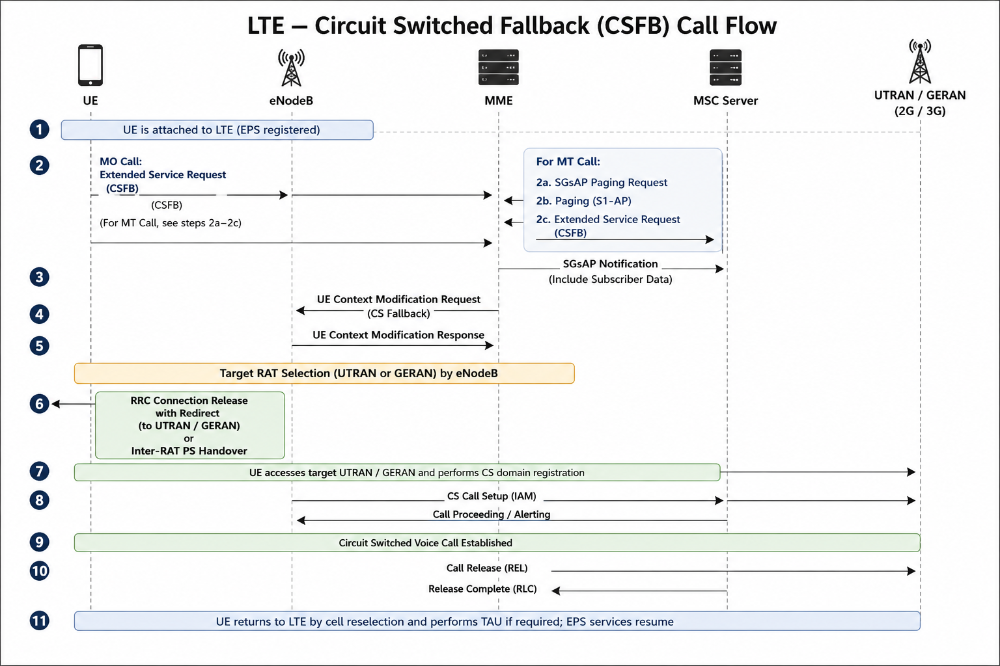

## Procedure Flow

### Step 1 – UE Attached to LTE

The UE is successfully attached to the LTE network through a Combined EPS/IMSI Attach procedure. The MME maintains both EPS mobility management and an SGs association with the MSC Server, enabling the UE to receive Circuit Switched services while remaining camped on LTE.

---

### Step 2 – CS Voice Service Triggered

A Circuit Switched voice service is initiated by either:

- **Mobile Originated (MO):** The UE initiates a voice call.
- **Mobile Terminated (MT):** The MSC Server receives an incoming call for the UE.

The network determines that the requested service requires Circuit Switched Fallback because VoLTE is unavailable, disabled, or not selected.

---

### Step 3 – CSFB Procedure Initiation

The CSFB procedure is initiated according to the call direction:

- For an **MO call**, the UE sends an **Extended Service Request** with the CSFB service type to the MME.
- For an **MT call**, the MSC Server sends an **SGsAP Paging Request** to the MME. The MME pages the UE over LTE, and the UE responds with an **Extended Service Request** indicating CS Fallback.

The MME validates the request and prepares the UE for mobility to the legacy Circuit Switched network.

---

### Step 4 – Target Radio Access Selection

The MME sends an S1-AP **UE Context Modification Request** to the serving eNodeB, indicating that Circuit Switched Fallback is required.

The eNodeB selects the target legacy Radio Access Technology (RAT) based on configured inter-RAT neighbor information and current radio conditions. The target network may be:

- UTRAN (3G)
- GERAN (2G)

---

### Step 5 – LTE to CS Network Mobility

The serving eNodeB transfers the UE from LTE to the selected legacy network using one of the following methods:

- **Redirection**, where the UE is instructed to reselect the target RAT.
- **PS Handover**, if inter-RAT handover is supported.

The UE establishes a radio connection with the target GERAN or UTRAN cell.

---

### Step 6 – Circuit Switched Call Establishment

After successfully accessing the legacy network, the UE performs the required Circuit Switched signaling with the MSC Server.

The MSC Server completes call setup, and the voice call is established over the Circuit Switched domain.

---

### Step 7 – Voice Call in Progress

During the active call:

- Voice traffic is carried through the Circuit Switched network.
- LTE packet data services are suspended or managed according to network capabilities.
- Mobility is controlled by the legacy Radio Access Network until the call is released.

---

### Step 8 – Return to LTE

When the voice call ends, the UE releases the Circuit Switched connection and returns to LTE using the normal mobility procedures.

Depending on the network configuration, the UE may:

- Reselect an LTE cell.
- Perform a Tracking Area Update (TAU), if required.
- Resume EPS packet data services.

## Call Flow Diagram

The following diagram illustrates the signaling flow for the Circuit Switched Fallback (CSFB) procedure.

---

## Success Criteria

The CSFB procedure is considered successful when:

- The UE successfully initiates or responds to the CSFB procedure.
- The UE is redirected or handed over to the target UTRAN or GERAN network.
- The Circuit Switched voice call is successfully established by the MSC Server.
- Voice communication is maintained without interruption during the call.
- After call release, the UE successfully returns to the LTE network.
- EPS services are resumed after re-entering LTE coverage.

---

## Failure Scenarios

Common reasons for CSFB procedure failure include:

- SGs association between the MME and MSC Server is not established.
- Combined EPS/IMSI Attach was not successfully completed.
- Extended Service Request is rejected by the MME.
- No suitable UTRAN or GERAN neighbor cell is available.
- Inter-RAT redirection or PS Handover fails.
- Radio Link Failure (RLF) occurs during fallback.
- The target legacy cell rejects the UE.
- UE does not support Circuit Switched Fallback.
- Circuit Switched call setup fails at the MSC Server.
- Timer expiry during paging, mobility, or call establishment.

---

## Troubleshooting

| Check | Description |
|-------|-------------|
| Combined Attach | Verify the UE completed a Combined EPS/IMSI Attach and is registered in both EPS and CS domains. |
| SGs Association | Confirm that the SGs association between the MME and MSC Server is established. |
| SGsAP Paging | Verify SGsAP Paging Request and Paging Response messages for Mobile Terminated calls. |
| Extended Service Request | Check that the UE sends an Extended Service Request with the correct CSFB service type. |
| S1AP Signaling | Verify UE Context Modification Request and Response between the MME and eNodeB. |
| Neighbor Configuration | Confirm that LTE-to-UTRAN/GERAN neighbor relations are correctly configured. |
| Inter-RAT Mobility | Verify successful LTE redirection or PS Handover to the target legacy network. |
| Target Cell Accessibility | Ensure the target UTRAN or GERAN cell is available and accepts the UE. |
| MSC Server Logs | Verify successful Circuit Switched call setup and release procedures. |
| UE Capability | Confirm that the UE supports CSFB and the required legacy radio technologies. |
| Performance Counters | Review CSFB Success Rate, Redirection Success Rate, Paging Success Rate, and CS Call Setup Success Rate KPIs. |

---

## Related Procedures

- Combined EPS/IMSI Attach
- Authentication
- Security Mode Control
- Initial Context Setup
- Service Request
- Tracking Area Update (TAU)
- X2 Handover
- S1 Handover
- SRVCC
- Dedicated Bearer Activation
---

## References

- 3GPP TS 23.272 – Circuit Switched (CS) Fallback in Evolved Packet System (EPS)
- 3GPP TS 23.401 – General Packet Radio Service (GPRS) Enhancements for E-UTRAN Access
- 3GPP TS 24.301 – Non-Access-Stratum (NAS) Protocol for EPS
- 3GPP TS 36.413 – S1 Application Protocol (S1AP)
- 3GPP TS 36.331 – E-UTRA Radio Resource Control (RRC)
