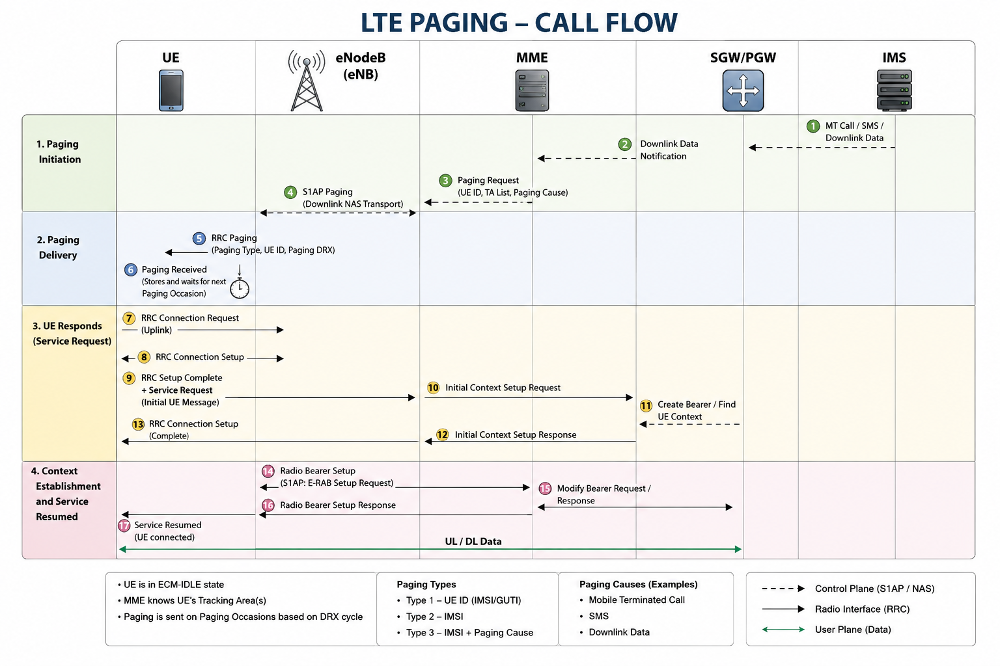

# LTE Paging Procedure

## Overview

The LTE Paging procedure is used to notify a User Equipment (UE) in **ECM-IDLE** state that the network has pending downlink data or signaling. Since the UE does not have an active S1 connection, the Mobility Management Entity (MME) instructs one or more eNodeBs to transmit a Paging message over the radio interface.

After receiving the Paging message, the UE initiates the **LTE Service Request** procedure to resume radio and core network connectivity.

Paging enables efficient battery usage by allowing the UE to remain idle while still being reachable for mobile-terminated services such as VoLTE calls, SMS delivery, and packet data.

---

## Purpose

The LTE Paging procedure allows the network to:

* Notify an idle UE of an incoming VoLTE call.
* Notify an idle UE of an incoming SMS.
* Notify an idle UE of pending downlink packet data.
* Trigger mobile-terminated signaling procedures.
* Resume communication by initiating the LTE Service Request procedure.

---

## Preconditions

Before Paging can occur:

* The UE has successfully completed the LTE Attach procedure.
* The UE is registered with the MME.
* The UE is in **ECM-IDLE** state.
* The MME knows the UE's current Tracking Area (TA) or Tracking Area List (TAL).
* The serving eNodeB(s) are operational.

---

## Network Elements Involved

* User Equipment (UE)
* eNodeB (eNB)
* Mobility Management Entity (MME)
* Serving Gateway (SGW)
* PDN Gateway (PGW)
* IMS Core (for VoLTE mobile-terminated calls)

---
## Common Paging Triggers

The network may initiate Paging for several reasons, including:

* Incoming VoLTE call
* Mobile-terminated SMS
* Downlink user data
* NAS signaling
* Emergency notifications
* IMS registration updates
---
## Call Flow

The following diagram illustrates the complete LTE Paging signaling procedure.

  

**Figure 1.** LTE Paging signaling procedure.

---

## Message Sequence

### 1. Downlink Data or Mobile-Terminated Service

The LTE Paging procedure begins when the network has pending traffic or signaling for a UE that is currently in **ECM-IDLE** state. Since the UE does not have an active S1 signaling connection, the network cannot immediately deliver the information.

Typical paging triggers include:

* Incoming VoLTE call (Mobile-Terminated Call)
* Mobile-Terminated SMS
* Downlink user data
* NAS signaling initiated by the core network

The Serving Gateway (SGW) or IMS notifies the Mobility Management Entity (MME) that data or signaling is waiting for the UE. The MME checks the UE context, identifies the last known Tracking Area List (TAL), and prepares to page the UE through the appropriate eNodeB(s).

**Purpose**

* Detect pending downlink traffic for an idle UE.
* Identify the UE's registered Tracking Area(s).
* Initiate the LTE Paging procedure.

**Key Point**

Paging is initiated only when the UE is in **ECM-IDLE**. If the UE is already in **ECM-CONNECTED**, the network delivers data directly without paging.

**Common Troubleshooting**

* Downlink data notification not received by the MME.
* UE context not found in the MME.
* Incorrect Tracking Area List (TAL).
* Paging procedure not initiated despite pending downlink data.
* IMS or SGW signaling failure preventing paging initiation.

### 2. S1AP Paging (MME → eNodeB)

After determining that the UE is in **ECM-IDLE** and has pending downlink traffic or signaling, the Mobility Management Entity (MME) sends an **S1AP Paging** message to one or more eNodeBs serving the UE's registered Tracking Area(s).

The MME selects the appropriate eNodeB(s) based on the UE's last known **Tracking Area List (TAL)**. Each selected eNodeB receives the Paging request over the **S1-MME interface** and prepares to broadcast the Paging message over the radio interface.

The S1AP Paging message typically contains:

* UE Identity (S-TMSI or IMSI)
* Tracking Area Identity (TAI) List
* Paging DRX (optional)
* CN Domain (PS or CS, when applicable)
* Paging Priority (optional)

**Purpose**

* Notify the serving eNodeB(s) that an idle UE needs to be paged.
* Provide sufficient information for the eNodeB to identify and page the correct UE.
* Initiate radio paging within the UE's registered Tracking Area(s).

**Key Point**

The MME may send the Paging message to **multiple eNodeBs** if the UE has registered a **Tracking Area List (TAL)** containing more than one Tracking Area. This increases the likelihood of successfully reaching the idle UE without knowing its exact serving cell.

**Common Troubleshooting**

* Paging sent to an incorrect Tracking Area due to an outdated UE location.
* Missing or invalid UE identity in the Paging message.
* S1 interface failures between the MME and eNodeB.
* Paging discarded because the eNodeB is unavailable or overloaded.
* Paging congestion caused by a high number of simultaneous paging requests.

### 3. RRC Paging (eNodeB → UE)

Upon receiving the **S1AP Paging** message from the MME, the eNodeB broadcasts an **RRC Paging** message over the LTE air interface (Uu interface). Unlike S1AP Paging, which is exchanged between the MME and eNodeB, RRC Paging is transmitted wirelessly for the UE to receive.

The eNodeB broadcasts the Paging message only within the Tracking Area(s) specified by the MME. The UE, while in **ECM-IDLE**, periodically wakes up according to its configured **Discontinuous Reception (DRX)** cycle to monitor the Paging Channel (PCH). If the Paging message contains the UE's identity, the UE recognizes that the page is intended for it and prepares to establish an RRC connection.

The RRC Paging message typically includes:

* UE Identity (S-TMSI or IMSI)
* Paging Record(s)
* Paging Cause (when applicable)
* System information required for paging reception

**Purpose**

* Notify the idle UE that the network has pending downlink data or signaling.
* Trigger the UE to establish an RRC connection.
* Maintain low battery consumption by allowing the UE to monitor the Paging Channel only during its configured Paging Occasion.

**Key Point**

The UE does **not** continuously listen to the radio interface while in **ECM-IDLE**. Instead, it wakes up only during its configured **Paging Occasion (PO)**, determined by its **DRX cycle**. This mechanism significantly reduces battery consumption while ensuring that the network can still reach the UE when required.

**Common Troubleshooting**

* UE does not receive the Paging message due to poor radio coverage.
* Incorrect DRX configuration causing missed Paging Occasions.
* UE camping on the wrong cell or Tracking Area.
* Radio interference resulting in Paging message loss.
* eNodeB fails to broadcast the Paging message after receiving the S1AP Paging request.

   ---
## 4. RRC Connection Request (UE → eNodeB)

After receiving the **RRC Paging** message and recognizing its identity, the UE initiates the establishment of an RRC connection by sending an **RRC Connection Request** message to the serving eNodeB.

The RRC Connection Request indicates that the UE wants to transition from **ECM-IDLE** to **ECM-CONNECTED** so that the pending downlink data or signaling can be delivered. The eNodeB processes the request and prepares to establish the radio connection.

The RRC Connection Request message typically contains:

* Establishment Cause
* UE Identity (Initial UE Identity)

**Purpose**

* Initiate the establishment of an RRC connection.
* Respond to the received Paging message.
* Begin the transition from ECM-IDLE to ECM-CONNECTED.

**Key Point**

The UE sends the RRC Connection Request only after successfully decoding the Paging message intended for it. Before this message, the UE has no dedicated radio resources allocated by the eNodeB.

**Common Troubleshooting**

* Random Access procedure failure.
* Poor radio coverage preventing the request from reaching the eNodeB.
* RRC Connection Request timeout.
* High uplink interference causing message loss.
* eNodeB unable to process new RRC connection requests due to congestion.

---

## 5. RRC Connection Setup (eNodeB → UE)

After successfully receiving the RRC Connection Request, the eNodeB allocates the required radio resources and responds with an **RRC Connection Setup** message.

The RRC Connection Setup configures the initial radio parameters required for communication between the UE and the network. Once received, the UE establishes the Signaling Radio Bearer (SRB) and prepares to send NAS signaling.

The RRC Connection Setup message typically contains:

* Radio Resource Configuration
* Signaling Radio Bearer (SRB) configuration
* Physical layer configuration
* MAC configuration
* RLC configuration

**Purpose**

* Allocate radio resources for the UE.
* Establish the initial signaling connection.
* Prepare the UE for NAS message transmission.

**Key Point**

At this stage, only the radio signaling connection is established. User-plane traffic cannot yet be transmitted until the core network completes the Service Request procedure and bearer setup.

**Common Troubleshooting**

* RRC Connection Setup not transmitted by the eNodeB.
* Radio configuration failure.
* UE unable to decode the RRC Connection Setup message.
* RRC setup timer expiry.
* Cell congestion preventing resource allocation.

---

## 6. RRC Connection Setup Complete + NAS Service Request (UE → eNodeB)

After successfully configuring the radio connection, the UE sends an **RRC Connection Setup Complete** message to the eNodeB. This message encapsulates the **NAS Service Request**, informing the MME that the UE is responding to the Paging procedure.

The NAS Service Request allows the MME to identify the UE, verify its security context, and resume the suspended EPS bearers. The eNodeB transparently forwards the NAS message to the MME without modifying its contents.

The RRC Connection Setup Complete message typically contains:

* RRC Connection Setup Complete
* NAS Service Request
* UE Identity
* Selected PLMN (when applicable)

**Purpose**

* Confirm successful establishment of the RRC connection.
* Deliver the NAS Service Request to the MME.
* Resume LTE signaling and user-plane connectivity.

**Key Point**

The Paging procedure itself does not restore connectivity. It simply notifies the UE. The actual restoration of the connection begins when the UE sends the NAS Service Request.

**Common Troubleshooting**

* NAS Service Request missing from the RRC message.
* Security context mismatch.
* Invalid NAS message.
* UE context not found in the MME.
* Radio message corruption.

---

## 7. Initial UE Message (eNodeB → MME)

After receiving the encapsulated NAS Service Request, the eNodeB forwards it to the MME using the **Initial UE Message** over the **S1-MME interface**.

The Initial UE Message establishes the signaling association between the UE and the MME. It includes the NAS Service Request along with information identifying the serving eNodeB and the UE's current location.

The S1AP Initial UE Message typically contains:

* NAS Service Request
* eNB UE S1AP ID
* TAI (Tracking Area Identity)
* ECGI (E-UTRAN Cell Global Identifier)
* S-TMSI (when available)

**Purpose**

* Forward the NAS Service Request to the MME.
* Associate the UE with the serving eNodeB.
* Allow the MME to continue the Service Request procedure.

**Key Point**

The eNodeB does not interpret or modify the NAS Service Request. It simply encapsulates the NAS message inside the S1AP Initial UE Message and forwards it to the MME.

**Common Troubleshooting**

* Initial UE Message not received by the MME.
* Incorrect TAI or ECGI information.
* S1 interface communication failure.
* UE context mismatch.
* S1AP message decoding errors.
---

## Troubleshooting

Common issues covered in this section include:

* UE does not receive Paging.
* Paging retransmissions.
* Incorrect Tracking Area List (TAL).
* MME paging failures.
* eNodeB paging failures.
* Paging congestion.
* Service Request not triggered after Paging.

---
The LTE Paging procedure is completed after the UE successfully resumes signaling and user-plane connectivity through the Service Request procedure.

## References

* 3GPP TS 23.401 – General Packet Radio Service (GPRS) enhancements for E-UTRAN access
* 3GPP TS 24.301 – Non-Access-Stratum (NAS) protocol for EPS
* 3GPP TS 36.300 – E-UTRAN overall description
* 3GPP TS 36.304 – User Equipment (UE) procedures in idle mode
* 3GPP TS 36.413 – S1 Application Protocol (S1AP)

---

## Related Procedures

* [LTE Attach](../Attach/README.md)
* [Tracking Area Update (TAU)](../TAU/README.md)
* [LTE Service Request](../Service-Request/README.md)
* LTE Detach *(Coming Soon)*

