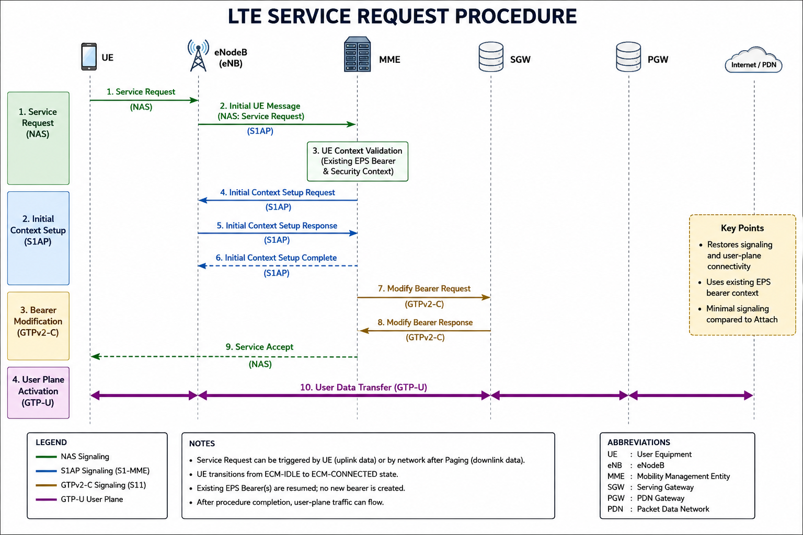

# LTE Service Request

## Overview

The LTE Service Request procedure is a mobility management procedure used to transition a User Equipment (UE) from **ECM-IDLE** to **ECM-CONNECTED** state when the UE needs to send or receive user data.

Unlike the Attach procedure, the Service Request does not create a new EPS session or establish new default bearers. Instead, it resumes existing signaling and user-plane resources, allowing the UE to continue communication using previously established EPS bearer contexts.

The procedure is commonly triggered by uplink data from the UE or by downlink data received from the network, making it one of the most frequently observed procedures in commercial LTE networks.

This document explains the LTE Service Request procedure, signaling sequence, protocol messages, important Information Elements (IEs), timers, common failure scenarios, and troubleshooting considerations based on 3GPP specifications.

## Purpose

The primary objectives of the LTE Service Request procedure are:

- Resume communication for an idle UE without performing a new Attach.
- Transition the UE from ECM-IDLE to ECM-CONNECTED state.
- Re-establish S1 signaling between the UE, eNodeB, and MME.
- Reactivate existing user-plane bearers.
- Enable uplink and downlink packet transmission.
- Reduce signaling overhead while maintaining efficient resource utilization.
## When is Service Request Triggered?

The Service Request procedure may be initiated under the following conditions:

### 1. Mobile Originated Data

The UE has uplink data to transmit while it is in ECM-IDLE state.

### 2. Mobile Terminated Data

The network receives downlink data for an idle UE. The MME pages the UE, and after responding to the page, the UE initiates the Service Request procedure.

### 3. VoLTE Call Establishment

Before SIP signaling and voice bearer activation, the UE performs a Service Request to resume connectivity.

### 4. SMS over NAS

Some SMS procedures require the UE to establish signaling resources before message delivery.

### 5. Other NAS Signaling

The UE may initiate a Service Request before NAS procedures that require an active S1 connection.
> **Engineer Note**
>
> Service Request is one of the most common procedures observed in MME traces. Unlike the Attach procedure, it does not create new EPS bearer contexts. Instead, it restores the existing connection, allowing rapid data transfer while minimizing signaling overhead. In live networks, Service Request procedures are frequently triggered by smartphone applications generating background traffic.

## Network Elements

The following network elements participate in the LTE Service Request procedure:

| Network Element | Function |
|-----------------|----------|
| **UE (User Equipment)** | Initiates the Service Request when uplink data needs to be transmitted or responds to paging for downlink data. |
| **eNodeB (eNB)** | Establishes the radio connection and forwards NAS signaling to the MME over the S1 interface. |
| **MME (Mobility Management Entity)** | Processes the Service Request, validates the UE context, establishes signaling connections, and coordinates bearer activation. |
| **Serving Gateway (SGW)** | Reactivates the user-plane tunnel and forwards user data between the eNodeB and the PDN Gateway. |
| **PDN Gateway (PGW)** | Continues providing connectivity to external packet data networks using the existing EPS bearer. |
| **HSS (Home Subscriber Server)** | Normally does not participate unless subscriber information needs to be updated or revalidated. |

> **Engineer Note**
>
> Unlike the Attach procedure, the HSS is typically **not involved** during a normal Service Request because the UE context already exists in the MME. This makes the procedure significantly faster and reduces signaling within the EPC.

## Call Flow

The following call flow illustrates a typical LTE Service Request procedure. The exact signaling sequence may vary depending on the trigger (uplink or downlink), paging, and bearer modification requirements.

| Step | Message | Protocol | Interface |
|------|---------|----------|-----------|
| 1 | Service Request | NAS | UE → eNodeB → MME |
| 2 | Initial UE Message | S1AP | eNodeB → MME |
| 3 | Initial Context Setup Request | S1AP | MME → eNodeB |
| 4 | Initial Context Setup Response | S1AP | eNodeB → MME |
| 5 | Modify Bearer Request | GTPv2-C | MME → SGW |
| 6 | Modify Bearer Response | GTPv2-C | SGW → MME |
| 7 | Service Accept (if applicable) | NAS | MME → UE |
| 8 | User Data Transfer | GTP-U | UE ↔ Network |

> **Engineer Note**
>
> One of the key differences between the Attach and Service Request procedures is that **no new EPS bearer is created**. Instead, the existing bearer is resumed by updating the downlink tunnel information through the S11 Modify Bearer procedure.
UE
│
├── Service Request
│
eNB
│
├── Initial UE Message
│
MME
│
├── Initial Context Setup Request
│
├── Modify Bearer Request
│
SGW
│
├── Modify Bearer Response
│
MME
│
└── Initial Context Setup Complete


## Step-by-Step Procedure

### Step 1 – Service Request

The UE initiates the Service Request procedure by sending a **Service Request** NAS message to the MME via the eNodeB.

The message identifies the UE using its S-TMSI and indicates that the UE requires signaling and user-plane resources to resume data communication.

**Purpose**

- Resume an existing EPS session.
- Request the transition from ECM-IDLE to ECM-CONNECTED.
- Provide the UE identity.
- Resume user-plane connectivity.

---

### Step 2 – Initial UE Message

The eNodeB encapsulates the NAS Service Request inside an **S1AP Initial UE Message** and forwards it to the MME.

The message also contains radio access information, including:

- ECGI (E-UTRAN Cell Global Identifier)
- TAI (Tracking Area Identity)
- eNB UE S1AP ID
- RRC Establishment Cause

**Purpose**

- Deliver the NAS Service Request to the MME.
- Inform the MME of the UE's current serving cell.

---

### Step 3 – UE Context Validation

The MME validates the existing UE context.

Typical checks include:

- Existing EPS bearer context
- NAS security context
- UE registration status
- Subscriber validity

If the stored context is valid, the procedure continues without requiring a new Attach.

---

### Step 4 – Initial Context Setup

The MME sends an **Initial Context Setup Request** to the eNodeB.

The request contains:

- Security information
- EPS bearer context
- Transport Layer Address
- GTP TEID
- QoS parameters

The eNodeB allocates the required radio resources and replies with an **Initial Context Setup Response**.

---

### Step 5 – Modify Bearer Procedure

The MME sends a **Modify Bearer Request** to the Serving Gateway (SGW).

The SGW updates the downlink user-plane tunnel and replies with a **Modify Bearer Response**.

This step activates the user-plane path for data transmission.

---

### Step 6 – Service Accept

If required, the MME sends a **Service Accept** NAS message to the UE.

This confirms that signaling and bearer resources have been successfully restored.

---

### Step 7 – User Data Transfer

After completion of the signaling procedures, user-plane traffic resumes.

The UE can now transmit and receive IP packets using the existing EPS bearer without performing a new Attach procedure.

> **Engineer Note**
>
> During Service Request troubleshooting, engineers should verify that the **Initial Context Setup** and **Modify Bearer** procedures complete successfully. These two procedures establish the radio resources and update the user-plane tunnel. Failures at this stage commonly result in successful NAS signaling but no user data flow.

UE
│
Service Request (NAS)
│
eNB
│
Initial UE Message (S1AP)
│
MME
│
Context Validation
│
Initial Context Setup (S1AP)
│
Modify Bearer (S11)
│
SGW
│
User Plane Active

## Important Information Elements (IEs)

The following Information Elements (IEs) are commonly found in the **Service Request**, **Initial Context Setup**, and **Modify Bearer** procedures.

| Information Element | Description |
|---------------------|-------------|
| S-TMSI | Temporary UE identity used to identify the subscriber during the Service Request procedure. |
| NAS Key Set Identifier (KSI) | Indicates the NAS security context currently used by the UE. |
| EPS Bearer ID (EBI) | Identifies the EPS bearer that is resumed for user-plane traffic. |
| M-TMSI | Part of the S-TMSI used by the MME to identify the UE. |
| Tracking Area Identity (TAI) | Indicates the Tracking Area where the UE is currently located. |
| E-UTRAN Cell Global Identifier (ECGI) | Identifies the serving LTE cell. |
| GTP Tunnel Endpoint Identifier (TEID) | Identifies the user-plane tunnel between the eNodeB and SGW. |
| QoS Parameters | Defines the Quality of Service for the resumed EPS bearer. |
| Transport Layer Address | Specifies the IP address associated with the GTP tunnel endpoint. |

> **Engineer Note**
>
> During MME trace analysis, the **S-TMSI**, **EPS Bearer ID (EBI)**, **TEID**, and **Tracking Area Identity (TAI)** are among the most important Information Elements. These fields allow engineers to correlate NAS, S1AP, and GTPv2-C signaling and verify that the correct bearer and tunnel are resumed.

## Timers

Several timers are associated with the LTE Service Request procedure.

| Timer | Purpose |
|--------|---------|
| **T3417** | Supervises the Service Request procedure. If it expires, the UE assumes the procedure has failed. |
| **T3417ext** | Extended supervision timer used in specific Service Request scenarios, depending on network implementation. |
| **T3411** | Controls the waiting period before the UE retries certain NAS procedures after failure. |
| **S1 Release Timer** | Used by the MME and eNodeB to release idle S1 signaling connections after inactivity. |
> **Engineer Note**
>
> While the NAS timers ensure reliable completion of the Service Request procedure, the **S1 Release** mechanism is responsible for transitioning the UE back to **ECM-IDLE** after a period of inactivity. Frequent Service Requests may indicate that S1 connections are being released too aggressively or that applications are generating frequent background traffic.

## Common Failure Scenarios

The following table summarizes common Service Request failures, their possible causes, and recommended troubleshooting actions.

| Failure Scenario | Possible Cause | Troubleshooting |
|------------------|---------------|-----------------|
| Service Request Rejected | Invalid UE context or registration state | Verify UE context in the MME and check NAS reject cause values. |
| Initial Context Setup Failure | Radio resource allocation failure | Review eNodeB logs, radio conditions, and S1AP signaling. |
| Modify Bearer Failure | SGW could not update the bearer | Verify S11 signaling, TEIDs, and SGW configuration. |
| Authentication Failure | NAS security context is no longer valid | Check authentication vectors and NAS security procedures. |
| S1AP Failure | Signaling failure between the eNodeB and MME | Verify SCTP connectivity, S1AP messages, and eNodeB status. |
| User Plane Failure | GTP-U tunnel not established | Verify GTP-U tunnel endpoints, TEIDs, and user-plane routing. |
| Timer Expiry | Procedure did not complete before timeout | Review retransmissions, signaling delays, and timer configuration. |

## Troubleshooting

When analyzing a failed LTE Service Request procedure, engineers should verify the following:

### 1. Verify the Trigger

Determine what initiated the Service Request:

- Mobile Originated (MO) data
- Mobile Terminated (MT) data following Paging
- VoLTE call establishment
- SMS over NAS
- Other NAS signaling procedures

### 2. Verify NAS Messages

Confirm that the following NAS messages are present:

- Service Request
- Service Accept (if applicable)

Ensure that the NAS message is correctly decoded and protected.

### 3. Verify S1AP Messages

Confirm successful exchange of:

- Initial UE Message
- Initial Context Setup Request
- Initial Context Setup Response

Verify that no S1AP Failure messages are present.

### 4. Verify Bearer Modification

Check the S11 interface for:

- Modify Bearer Request
- Modify Bearer Response

Ensure that the SGW successfully updated the downlink GTP tunnel.

### 5. Verify User Plane

Confirm that:

- GTP-U tunnels are established.
- TEIDs are correct.
- User traffic flows successfully after the procedure.

### 6. Verify UE Context

Check that:

- UE context exists in the MME.
- EPS Bearer Context is valid.
- NAS Security Context is synchronized.

### 7. Verify MME Logs

Review MME logs for:

- NAS reject causes
- S1AP failures
- Bearer modification failures
- Timer expiry events
- Context lookup failures

### 8. Verify Interfaces

Check signaling on the following interfaces:

- Uu (UE ↔ eNodeB)
- S1-MME (eNodeB ↔ MME)
- S11 (MME ↔ SGW)
- S5/S8 (SGW ↔ PGW, if applicable)

### 9. Check the Final Outcome

Determine whether the procedure completed successfully:

- Service Accept received
- Initial Context Setup completed
- Modify Bearer completed
- User-plane traffic established

## Engineer's Checklist

Before closing a Service Request-related issue, verify the following:

- ✅ UE successfully initiated the Service Request.
- ✅ Initial UE Message reached the MME.
- ✅ Existing UE context was found in the MME.
- ✅ Initial Context Setup completed successfully.
- ✅ Modify Bearer completed successfully.
- ✅ Correct GTP TEIDs were allocated.
- ✅ User-plane tunnel was established.
- ✅ No NAS or S1AP decoding errors were observed.
- ✅ User traffic successfully resumed.
- ✅ No abnormal timer expiries or retransmissions occurred.

  ## References

The following 3GPP specifications were used as technical references for this document:

| Specification | Description |
|--------------|-------------|
| **3GPP TS 23.401** | GPRS Enhancements for E-UTRAN (EPC Architecture and Procedures). |
| **3GPP TS 24.301** | Non-Access-Stratum (NAS) protocol for the Evolved Packet System (EPS). |
| **3GPP TS 29.274** | GTPv2-C protocol for EPC interfaces, including S11 bearer management procedures. |
| **3GPP TS 36.413** | S1 Application Protocol (S1AP). |
| **3GPP TS 33.401** | EPS Security Architecture. |
## About This Document

This document is part of the **Telecom Call Flows** project, an open-source knowledge base covering LTE, EPC, IMS, VoLTE, VoNR, and 5G Core signaling procedures.

The objective is to provide practical, engineer-focused documentation that combines 3GPP standards with real-world operational and troubleshooting experience from commercial mobile core networks.

```markdown
## Related Procedures

- [LTE Attach](../Attach/README.md)
- [Tracking Area Update (TAU)](../TAU/README.md)
- LTE Paging *(Coming Soon)*
- LTE Detach *(Coming Soon)*
```


