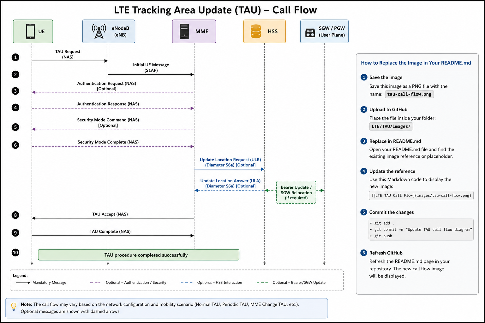

# LTE Tracking Area Update (TAU)
**Last Updated:** July 2026

**3GPP References:** TS 23.401, TS 24.301, TS 36.413
## Table of Contents

- Overview
- Purpose
- Types of TAU
- When is TAU Triggered?
- Network Elements
- Call Flow
- Step-by-Step Procedure
- Important Information Elements (IEs)
- Timers
- Common Failure Scenarios
- Troubleshooting
- Engineer's Checklist
- References

## Overview

Tracking Area Update (TAU) is an LTE Mobility Management procedure that allows the User Equipment (UE) to inform the Mobility Management Entity (MME) that it has entered a new Tracking Area (TA) or to periodically confirm its presence within the network.

The TAU procedure ensures that the network always maintains an up-to-date location of the UE while it remains in ECM-IDLE state. This enables efficient paging for incoming services, supports seamless mobility across Tracking Areas, and minimizes unnecessary signaling.

Depending on the mobility scenario, the TAU procedure may also be used to update the UE's security context, EPS bearer information, Tracking Area List (TAL), or other mobility-related parameters.

This document explains the LTE Tracking Area Update procedure, signaling sequence, protocol messages, important Information Elements (IEs), timers, common failure scenarios, and troubleshooting considerations based on 3GPP specifications.

## Purpose

The primary objectives of the Tracking Area Update (TAU) procedure are:

- Inform the network that the UE has moved to a new Tracking Area (TA).
- Update the UE's location in the Mobility Management Entity (MME).
- Enable the network to accurately page the UE for incoming services while it is in ECM-IDLE state.
- Refresh the UE's registration through periodic TAU, even when no mobility has occurred.
- Update mobility-related information such as the Tracking Area List (TAL), security context, EPS bearer context, and UE capabilities when required.
- Maintain seamless mobility and service continuity as the UE moves within the LTE network.

  ## Types of TAU

The LTE network supports several types of Tracking Area Update procedures depending on the reason for the update.

| TAU Type | Description |
|----------|-------------|
| Normal TAU | Triggered when the UE enters a Tracking Area that is not included in its current Tracking Area List (TAL). |
| Periodic TAU | Triggered when the T3412 periodic update timer expires, allowing the UE to confirm its presence without changing location. |
| Combined TA/LA Update | Performed when combined EPS/IMSI attach is supported, allowing simultaneous Tracking Area Update (LTE) and Location Area Update (CS domain). |
| MME Change TAU | Occurs when the UE moves into an area served by a different MME, requiring context transfer between MMEs. |

> **Engineer Note**
>
> In operational LTE networks, **Periodic TAU** is one of the most commonly observed TAU procedures because it is driven by the T3412 timer. **Normal TAU** is typically seen when a subscriber crosses Tracking Area boundaries. **MME Change TAU** is especially important during troubleshooting because it involves S10 context transfer and may reveal issues related to MME connectivity, context synchronization, or subscriber data consistency.

## When is TAU Triggered?

The UE initiates the Tracking Area Update (TAU) procedure under the following conditions:

### 1. Tracking Area Change

When the UE moves into a Tracking Area (TA) that is not included in its current Tracking Area List (TAL), it initiates a Normal TAU procedure to update its location in the network.

### 2. Periodic Registration Update

When the periodic TAU timer (T3412) expires, the UE performs a Periodic TAU to inform the network that it is still reachable, even if it has not changed location.

### 3. MME Change

If the UE moves into an area served by a different Mobility Management Entity (MME), the TAU procedure enables the target MME to obtain the UE context from the source MME through the S10 interface.

### 4. Combined TA/LA Update

If Circuit Switched (CS) fallback or combined EPS/IMSI registration is supported, the UE may perform a Combined Tracking Area Update and Location Area Update.

### 5. Network Requested Update

The network may require the UE to perform a TAU after specific mobility management events, security procedures, or configuration changes.

> **Engineer Note**
>
> In commercial LTE networks, the majority of TAU procedures are either **Periodic TAU** (triggered by the T3412 timer) or **Normal TAU** (triggered when the UE leaves its assigned Tracking Area List). MME Change TAU procedures occur less frequently but are critical during inter-MME mobility and roaming scenarios.

## Network Elements

The following network elements participate in the LTE Tracking Area Update procedure:

| Network Element | Function |
|-----------------|----------|
| **UE (User Equipment)** | Detects the need for a TAU and initiates the procedure. |
| **eNodeB (eNB)** | Provides radio access and forwards NAS signaling between the UE and the MME over the S1 interface. |
| **MME (Mobility Management Entity)** | Processes the TAU request, performs authentication and security checks if required, updates the UE context, and manages mobility. |
| **HSS (Home Subscriber Server)** | Provides updated subscriber profile information when required, particularly during MME relocation or context update. |
| **Serving Gateway (SGW)** | Maintains the user-plane tunnel. During some TAU procedures (for example, SGW relocation), it may update bearer information. |
| **PDN Gateway (PGW)** | Usually remains unchanged but continues providing connectivity to external packet data networks throughout the mobility procedure. |

## Call Flow

The following call flow illustrates a typical **Normal Tracking Area Update (TAU)** procedure in an LTE EPC network. The exact signaling sequence may vary depending on whether authentication, security procedures, MME relocation, or bearer updates are required.

| Step | Message | Interface |
|------|---------|-----------|
| 1 | TAU Request | UE → eNodeB → MME |
| 2 | Initial UE Message | S1AP |
| 3 | Authentication Request *(if required)* | MME → UE |
| 4 | Authentication Response | UE → MME |
| 5 | Security Mode Command *(if required)* | MME → UE |
| 6 | Security Mode Complete | UE → MME |
| 7 | Update Location Request *(optional)* | MME → HSS |
| 8 | Update Location Answer *(optional)* | HSS → MME |
| 9 | TAU Accept | MME → UE |
|10 | TAU Complete | UE → MME |

> **Engineer Note**
>
> Authentication and Security Mode procedures are not executed during every TAU. If the existing security context remains valid, the MME may directly process the TAU Request and respond with a TAU Accept, reducing signaling overhead and improving mobility performance.

## Step-by-Step Procedure

### Step 1 – TAU Request

The UE initiates the Tracking Area Update procedure by sending a **TAU Request** NAS message to the MME via the eNodeB.

The message contains the UE's identity, the update type (Normal, Periodic, Combined, etc.), old GUTI (if available), security parameters, and other mobility-related information required by the MME.

**Purpose**

- Inform the network that the UE requires a Tracking Area Update.
- Identify the UE.
- Indicate the reason for the TAU procedure.
- Provide the current security context.

---

### Step 2 – Initial UE Message

The eNodeB encapsulates the NAS TAU Request inside an **S1AP Initial UE Message** and forwards it to the MME.

The Initial UE Message also includes radio access information such as:

- ECGI (E-UTRAN Cell Global Identifier)
- TAI (Tracking Area Identity)
- S1AP UE IDs
- RRC Establishment Cause

**Purpose**

- Transfer the NAS message to the MME.
- Inform the MME about the UE's current serving cell.

---

### Step 3 – Authentication Procedure (Optional)

If the MME determines that authentication is required, it sends an **Authentication Request** to the UE.

The UE validates the challenge using the USIM and returns an **Authentication Response**.

This step may be skipped if the existing security context is still valid.

---

### Step 4 – Security Mode Procedure (Optional)

If required, the MME initiates a **Security Mode Command**.

The UE verifies the selected security algorithms and responds with a **Security Mode Complete** message.

This ensures that NAS signaling is integrity protected and encrypted.

---

### Step 5 – Subscriber Context Update (Optional)

Depending on the mobility scenario, the MME may communicate with the HSS using the **Update Location Request (ULR)** and **Update Location Answer (ULA)** procedures.

This typically occurs when:

- The UE moves to a different MME.
- Subscriber information needs to be refreshed.
- The serving MME changes.

---

### Step 6 – TAU Accept

After successfully processing the request, the MME sends a **TAU Accept** message.

The message may include:

- Updated Tracking Area List (TAL)
- New GUTI (if allocated)
- Updated T3412 timer value
- EPS bearer information (if applicable)

This indicates that the Tracking Area Update has completed successfully.

---

### Step 7 – TAU Complete

The UE acknowledges the successful completion of the procedure by sending a **TAU Complete** message.

After receiving this message, the MME updates the UE context and the TAU procedure is considered complete.

> **Engineer Note**
>
> During troubleshooting, the **TAU Request** and **TAU Accept** messages are the most important NAS messages to analyze. If the procedure fails before the TAU Accept, engineers should verify authentication, security procedures, UE identity, TAI configuration, subscriber profile, and any inter-MME context transfer (S10) when applicable. In successful cases, also verify whether a new GUTI or updated Tracking Area List (TAL) was assigned.

## Important Information Elements (IEs)

The following Information Elements (IEs) are commonly found in the **TAU Request** and **TAU Accept** messages.

| Information Element | Description |
|---------------------|-------------|
| EPS Update Type | Indicates the reason for the TAU procedure (Normal, Periodic, Combined, etc.). |
| Old GUTI | Identifies the UE using its previously assigned Globally Unique Temporary Identifier. |
| Native NAS Key Set Identifier (KSI) | Identifies the NAS security context currently used by the UE. |
| UE Network Capability | Indicates the security and protocol capabilities supported by the UE. |
| Tracking Area Identity (TAI) | Identifies the current Tracking Area where the UE is located. |
| DRX Parameter | Indicates the UE's paging cycle, if provided. |
| EPS Bearer Context Status | Indicates the status of the UE's existing EPS bearers. |
| TMSI Status | Indicates whether the UE still holds a valid temporary identity. |
| MS Network Capability *(optional)* | Provides additional UE capability information, mainly for interworking with legacy networks. |
| Additional Update Type *(optional)* | Indicates special update scenarios such as CIoT optimizations. |

> **Engineer Note**
>
> During trace analysis, the **Old GUTI**, **Tracking Area Identity (TAI)**, **EPS Update Type**, and **NAS Key Set Identifier (KSI)** are among the first Information Elements to verify. These fields help determine why the TAU was initiated, whether the UE is using a valid security context, and if the TAU was triggered by mobility, a periodic timer, or another event.

## Timers

Several timers are associated with the Tracking Area Update procedure.

| Timer | Purpose |
|--------|---------|
| **T3412** | Controls the periodic Tracking Area Update interval. When the timer expires, the UE initiates a Periodic TAU. |
| **T3402** | Started after certain attach or TAU failures. During this period, the UE is temporarily prevented from reattempting network registration. |
| **T3411** | Controls the delay before the UE retries a failed registration procedure. |
| **T3346** | Used by the network to instruct the UE to delay further registration attempts, helping to reduce signaling load during congestion. |

> **Engineer Note**
>
> In commercial LTE networks, **T3412** is the timer most frequently associated with TAU procedures. If a large number of UEs perform Periodic TAU simultaneously due to timer configuration, the MME may experience a signaling surge. Operators typically optimize T3412 values to balance network load and UE battery consumption.

## Common Failure Scenarios

The following table summarizes common TAU failures, their possible causes, and recommended troubleshooting actions.

| Failure Scenario | Possible Cause | Troubleshooting |
|------------------|---------------|-----------------|
| Tracking Area Not Allowed | UE entered a forbidden or unsupported Tracking Area | Verify TAC configuration, TAI List, and neighbor cell configuration. |
| PLMN Not Allowed | Subscriber is not permitted to register on the selected PLMN | Verify roaming agreements, PLMN configuration, and subscriber profile in the HSS. |
| Illegal UE | Invalid or unknown UE identity | Verify IMSI/GUTI, subscriber provisioning, and HSS database records. |
| Authentication Failure | Authentication vectors do not match or USIM verification failed | Check Authentication Request/Response messages, HSS vectors, and NAS security parameters. |
| Security Mode Failure | NAS security negotiation failed | Verify selected integrity and ciphering algorithms, NAS Key Set Identifier (KSI), and security context synchronization. |
| MME Context Transfer Failure | UE context could not be transferred during inter-MME mobility | Verify S10 connectivity, context transfer procedures, and source/target MME communication. |
| TAU Reject Received | The MME rejects the TAU request | Analyze the EMM cause value and determine the rejection reason according to 3GPP specifications. |
| Timer Expiry | UE does not receive a response before timer expiration | Verify radio conditions, S1 signaling, retransmissions, and MME processing delays. |

## Troubleshooting

When analyzing a failed Tracking Area Update procedure, engineers should verify the following:

### 1. Verify the Trigger

- Was the TAU triggered by mobility or by the T3412 periodic timer?
- Did the UE move outside its Tracking Area List (TAL)?

### 2. Verify NAS Messages

Confirm that the following NAS messages are present:

- TAU Request
- Authentication Request / Response (if applicable)
- Security Mode Command / Complete (if applicable)
- TAU Accept or TAU Reject
- TAU Complete

### 3. Verify Tracking Area Information

Check:

- MCC
- MNC
- TAC
- Tracking Area Identity (TAI)
- Tracking Area List (TAL)

Ensure the reported TAC belongs to the configured Tracking Area List.

### 4. Verify Subscriber Information

Confirm that:

- IMSI is valid.
- GUTI is correctly assigned.
- Subscriber is active in the HSS.
- Roaming permissions are correctly configured.

### 5. Verify Security

Check:

- Authentication vectors
- NAS security context
- NAS Key Set Identifier (KSI)
- Integrity protection
- Ciphering algorithms

### 6. Verify MME Logs

Review MME logs for:

- EMM Cause Values
- NAS Reject Causes
- Authentication failures
- Context transfer failures
- Timer expiry events

### 7. Verify Interfaces

Check signaling on the following interfaces:

- Uu (UE ↔ eNodeB)
- S1-MME (eNodeB ↔ MME)
- S6a (MME ↔ HSS)
- S10 (MME ↔ MME, if applicable)

### 8. Check the Final Outcome

Determine whether the procedure ended with:

- TAU Accept
- TAU Reject
- Authentication Failure
- Security Failure
- Radio Failure
- UE Timeout
## Engineer's Checklist

Before closing a TAU-related issue, verify the following:

- ✅ UE successfully initiated the TAU Request.
- ✅ Correct TAC and TAI were received by the MME.
- ✅ Authentication completed successfully (if required).
- ✅ Security Mode procedure completed successfully (if required).
- ✅ Subscriber profile was successfully retrieved from the HSS (if applicable).
- ✅ No S1AP or NAS decoding errors were observed.
- ✅ TAU Accept was sent by the MME.
- ✅ UE responded with TAU Complete.
- ✅ Updated GUTI and Tracking Area List (TAL) were assigned when applicable.
- ✅ No abnormal timer expiries or retransmissions occurred.

  ## References

The following 3GPP specifications were used as technical references for this document:

| Specification | Description |
|--------------|-------------|
| **3GPP TS 23.401** | General Packet Radio Service (GPRS) enhancements for Evolved Universal Terrestrial Radio Access Network (E-UTRAN). |
| **3GPP TS 24.301** | Non-Access-Stratum (NAS) protocol for Evolved Packet System (EPS). |
| **3GPP TS 29.274** | GPRS Tunnelling Protocol User Plane (GTPv2-C) for EPC interfaces. |
| **3GPP TS 36.413** | S1 Application Protocol (S1AP). |
| **3GPP TS 33.401** | EPS Security Architecture. |

## About This Document

This document is part of the **Telecom Call Flows** project, an open-source knowledge base covering LTE, EPC, IMS, VoLTE, VoNR, and 5G Core signaling procedures.

The objective is to provide practical, engineer-focused documentation that combines 3GPP standards with real-world operational and troubleshooting experience from commercial mobile core networks.

## Related Procedures

- LTE Attach
- LTE Service Request
- LTE Paging
- LTE Detach

